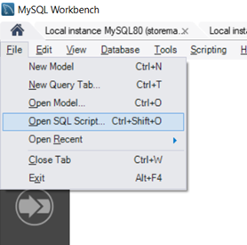
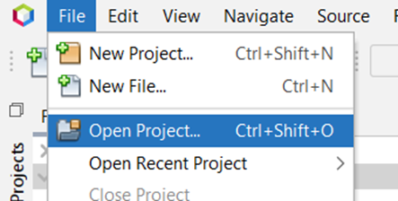
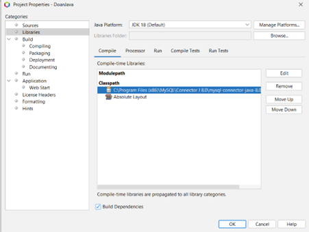
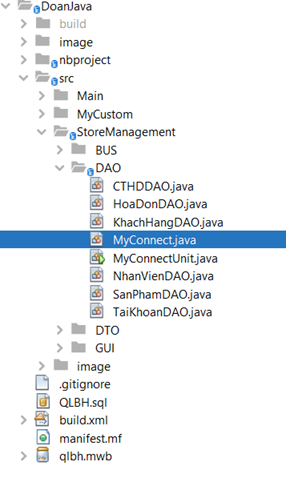
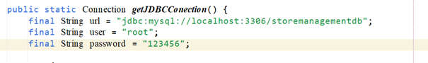
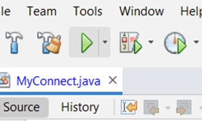
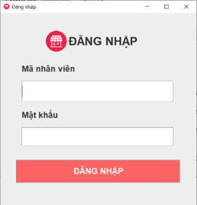

# storeManagement

Cài các công cụ hỗ trợ
======================

Để cài đặt và sử dung ứng dụng trên windows cần cài đặt một số ứng dụng
sau:

-   Apache NetBeans 13:
    https://netbeans.apache.org/download/nb13/nb13.html

-   MySQL và MySQL Workbench 8.0 CE:
    https://dev.mysql.com/downloads/workbench/

-   JDBC Jconnector 8.0.29: https://dev.mysql.com/downloads/connector/j/

Các bước cài đặt
================

**Bước 1:** Tải source code từ github và giải nén:

<https://github.com/thanhbinh030301/storeManagement>

**Bước 2:** Tạo cơ sở dữ liệu:

Mở phần mềm MySQL Workbench và tạo tài khoản root cùng với mật khẩu (cần
phải ghi nhớ mật khẩu) và login vào MySQL để tạo cơ sở dữ liệu. Sau đó
chọn **File &gt; Open SQL Script** tìm đến đường dẫn của source code vửa
tải từ bước 1 và thực thi.

 <em>Hình 1. Mở cơ sở dữ liệu.</em>

**Bước 3:** Kết nối ứng dụng với cơ sở dữ liệu

Mở Apache Netbeans, chọn **File &gt;Open project** sau đó tìm đến đường
dẫn của source code vửa tải từ bước 1.

<em>Hình 2. Mở Project Java.</em>

Sau đó **click chuột phải** vào project vừa open từ bước 3 và chọn
**Properties**. Chọn đến **Libraries &gt; Classpath &gt; Edit** tìm đến
đường dẫn **Jconnector** đã chuẩn bị từ trước và click **Ok**

<em>Hình 3. Kết nối với</em>
Jconnector.

Tại cây thư mục mở chọn file **MyConnect.java** như hình dưới đây.

<em>Hình 4. Vị trí file
MyConnect.java</em>

Bên trong **MyConnect.java** tìm đến hàm **getJDBCConection()**. Thay
đổi phần password trung khớp với mật khẩu MySQL tạo ở bước 2.

<em>Hình 5. Thay đổi mật khẩu
tại password.</em>

**Bước 4:** Chạy ứng dụng bằng cách click vào nút tam giác màu xanh lá
trên thanh công cụ:

<em>Hình 6. Chạy ứng dụng.</em>

Cửa sổ đăng nhập sẽ hiện ra, tài khoản Quản lý mặc định admin, mật khẩu
là admin.

<em>Hình 7. Giao diện đăng
nhập xuất hiện.</em>
